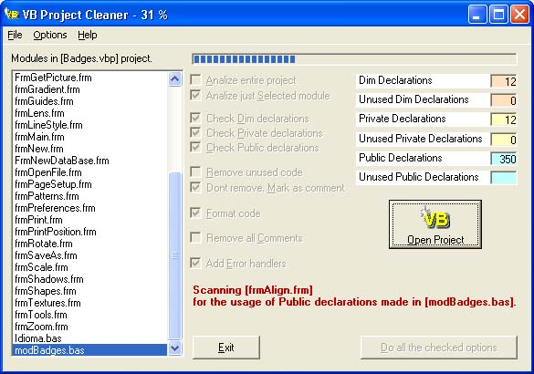



## VB Project Cleaner

### Description

(Version 1.0.5) This small program is not a VB project analyzer, but a VB project cleaner. The purpose is to search for all declarations, variables, constants and procedures unused on Visual Basic 6 projects. I made this program for my use, because I had necessity to free my projects of the accumulated garbage.

After opened the VB Project, VB Project Cleaner creates a new folder (inside your project folder) named Clean_(and followed by your project Folder´s name), for where the project files, forms, modules and class modules, effectively used, are copied - it is the first step of cleanness.

All the operations are processed on these duplicates, therefore, there is no risk to ruin the original code.

After that, the program searchs for unused declarations. Depending on the choice made in [Remove unused code] and [Do not remove. Mark as comments] options, the unused code will be removed from the file or marked as a comment line. The program converts Dim declarations, made in declarations zone, to Private. Also, Public declarations, used only in the module where they are declared, are converted to Private.

Format text code - with this option checked, the text code is formated.

Add error handlers - error handlers are added to every procedure (except if there is already a error handler). If a error ocurs, a message box displays the error number, error description, name of the procedure and name of the module.

Remove all comments - all comments are removed from the code.
 
### More Info
 
No inputs

Just open the project and make a Exe file.

Returns a cleaned code of your project

No side effects

             |
---                |---
**Submitted On**   |2002-09-19 12:02:08
**By**             |[Franco Gomes](https://github.com/Planet-Source-Code/PSCIndex/blob/master/ByAuthor/franco-gomes.md)
**Level**          |Advanced
**User Rating**    |4.7 (118 globes from 25 users)
**Compatibility**  |VB 6\.0
**Category**       |[Debugging and Error Handling](https://github.com/Planet-Source-Code/PSCIndex/blob/master/ByCategory/debugging-and-error-handling__1-26.md)
**World**          |[Visual Basic](https://github.com/Planet-Source-Code/PSCIndex/blob/master/ByWorld/visual-basic.md)
**Archive File**   |[VB\_Project1332879192002\.zip](https://github.com/Planet-Source-Code/franco-gomes-vb-project-cleaner__1-38331/archive/master.zip)

### API Declarations

Just one API declaration (to run the Help file)

